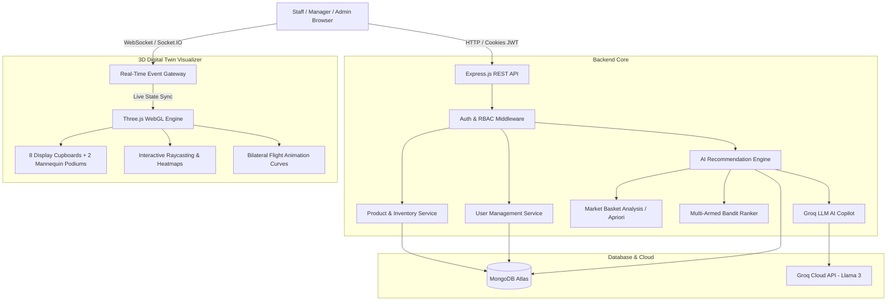

# 🛍️ Velocity Retail — Capstone Project Documentation
> **Autonomous AI-Driven Merchandising Engine & 3D Interactive Digital Twin Showroom**  
> **Student / Developer:** Aaron Alen  
> **Tech Stack:** React 18, TypeScript, Three.js (WebGL), Node.js, Express, MongoDB Atlas, Socket.IO, Groq AI (Llama 3), TailwindCSS, React-Icons.

---

## 📌 Executive Summary

**Velocity Retail** is an enterprise-grade Autonomous Retail Intelligence Platform. It bridges the gap between digital e-commerce analytics and brick-and-mortar retail stores by creating a **real-time 3D Digital Twin Showroom**.

Instead of static physical store planograms that take weeks to rearrange, Velocity Retail uses **Market Basket Analysis (Apriori algorithm)**, **Multi-Armed Bandit Reinforcement Learning**, and **LLM AI Copilots** to dynamically recommend and simulate the optimal placement of apparel and accessories on store mannequins and high-traffic display shelves.

When a store manager approves an AI recommendation, the system executes a **bilateral physical swap** where products dynamically animate between cupboards and mannequins in full 3D physics, updating MongoDB and broadcasting live to all connected terminals via WebSockets.

---

## 🏗️ System Architecture & Workflow



---

## 💎 Core Innovation & Key Modules

### 1. 🌐 3D Interactive Digital Twin Showroom (Three.js WebGL)
* **Digital Twin Mapping**: An exact 3D replica of a luxury retail flagship store containing:
  * **8 Cupboard Display Shelves** (categorized into Shirts, T-Shirts, Jeans, Jackets, Shoes).
  * **2 Hero Mannequin Stations** (Featured Mannequin 1 & Featured Mannequin 2) on elevated pedestals with warm ambient spotlighting.
* **Elevated 3D Footwear Rendering**: Custom vertical offset algorithms ensure shoes rest above the pedestal plane without clipping through the mannequin stand.
* **Interactive Tooling**:
  * 360° Free OrbitControls, Pan, Pinch-to-Zoom, Preset Camera Angles (Hero 1 Focus, Hero 2 Focus, Bird's-Eye Top View, Front Showcase).
  * Day / Warm Luxury Evening / Showroom Spotlight lighting modes.
  * Real-Time Stock Heatmap visualizing sales density per shelf.
* **Bilateral 2-Way Flight Physics**:
  * When an outfit recommendation is deployed, the incoming item flies from its shelf slot onto the mannequin along a quadratic Bezier trajectory.
  * Any displaced product currently on the mannequin automatically flies backwards to its assigned home shelf.
  * Real-time audio-visual feedback with glowing particles.

---

### 2. 🧠 AI Recommendation & Merchandising Engine
The platform implements a multi-tier algorithmic decision system:

#### A. Market Basket Association (Apriori Algorithm)
* Analyzes historical customer POS transaction baskets.
* Computes mathematical rules:
  $$\text{Support}(A \rightarrow B) = \frac{P(A \cap B)}{N}$$
  $$\text{Confidence}(A \rightarrow B) = \frac{P(A \cap B)}{P(A)}$$
  $$\text{Lift}(A \rightarrow B) = \frac{\text{Confidence}(A \rightarrow B)}{P(B)}$$
* Identifies synergistic outfit pairings (e.g., *Navy Linen Blazer* + *Slim Beige Chinos* + *Tan Leather Loafers*).

#### B. Contextual Multi-Armed Bandit (MAB)
* Balances **Exploitation** (recommending proven high-revenue bestsellers) with **Exploration** (testing new or slow-moving items with high profit margins).
* Calculates dynamically adjusted confidence scores based on real-time inventory velocity.

#### C. Incremental Floor Swap State Machine
* Manages multi-product stacking per station (Outerwear, Topwear, Bottomwear, Footwear).
* Supports **1-by-1 incremental product swaps** as well as full outfit swaps.
* Preserves baseline shelf coordinates in MongoDB `FloorSwap` collection.
* Full atomic reset button reverts all active station items back to their home slots without wildcard displacement bugs.

---

### 3. 🤖 AI Store Copilot (Groq LLM Integration)
* Powered by Groq's high-speed inference engine running **Llama 3**.
* Connected directly to live showroom inventory:
  * Can answer natural language queries: *"Which items are at risk of stockout this week?"*, *"Suggest a high-margin pair for station 1"*, *"How are footwear sales trending?"*.
  * Features 1-click prompt pills for instant analytics.

---

### 4. 🔐 Enterprise RBAC & Security (Role-Based Access Control)
Separation of duties implemented via JWT HttpOnly cookies and server middleware:

| Role | Permissions & Access Scope |
| :--- | :--- |
| 👑 **Store Administrator** (`admin`) | Full control: Add/Edit/Delete products, Access User Management, create new employee accounts, modify team roles, approve floor swaps. |
| 👔 **Floor Manager** (`manager`) | Inventory management, 3D showroom execution, AI recommendation review, stock adjustments. (Hidden from User Roster). |
| 🛒 **Cashier / Associate** (`staff`) | Quick Sale POS terminal, real-time stock lookup, customer checkout. (Restricted from editing prices, deleting products, or accessing user accounts). |

* **Security Highlights**:
  * Passwords hashed using `bcryptjs` with salt rounds.
  * JWT tokens stored in `HttpOnly, Secure, SameSite=Strict` cookies (protected against XSS and token theft).
  * Protected routes in React via `<PrivateRoute roles={['admin']} />`.
  * Public registration disabled on Login page; only authenticated Admins can provision accounts via `POST /api/users`.

---

### 5. ⚡ Real-Time POS Quick Sale & Stock Velocity Tracking
* Interactive POS modal supporting Cash, UPI, and Card transactions.
* Instantaneous stock decrement and automated order ledger creation.
* Real-time calculation of:
  * **Daily Velocity ($V_d$)**
  * **Days of Stock Remaining ($DSR = \frac{\text{Current Stock}}{V_d}$)**
  * Low-stock alert badge in top navigation.

---

### 6. 🎨 Luxury Aesthetic & UI/UX Design System
* **Warm Luxury Alabaster Cream & Soft Ivory Linen Theme** (`#F8F3EA`).
* Zero harsh dark backgrounds; replaced with boutique luxury gradients and warm ambient halos.
* Unified icon system using `react-icons` exclusively.
* 100% transparent scrollbar track background eliminating gray browser bars.
* Full-viewport `createPortal` modal overlays with `backdrop-blur-md` for seamless depth.

---

## 🗄️ Database Models (MongoDB Mongoose)

1. **`User`**: `name`, `email`, `password` (bcrypt), `role` (`admin` | `manager` | `staff`), `timestamps`.
2. **`Product`**: `name`, `category`, `price`, `stock`, `costPrice`, `salesVelocity`, `image`, `coordinates` (`x, y, z, rotation`).
3. **`FloorSwap`**: `activePairId`, `stationId`, `spotIndex`, `executedItems` (productId, fromCoord, toCoord, role), `displacedItems`, `status` (`active` | `reverted`), `timestamps`.
4. **`Order`**: `items`, `totalAmount`, `paymentMethod`, `customerName`, `timestamps`.

---

## 🎤 Mentor Presentation Walkthrough (Step-by-Step Script)

When demonstrating the project to your mentor, follow this flow:

### Step 1: Login & RBAC Demonstration (2 mins)
1. Open `http://localhost:5173/login`.
2. Point out the **clean, warm luxury aesthetic** and mention that public registration is intentionally disabled.
3. Click the **👑 Admin** demo pill and log in.
4. Navigate to the **Users** tab:
   * Show the team roster and role breakdown.
   * Click **"+ Add Team Member"** and demonstrate the `createPortal` modal with full viewport blur.
   * Explain backend security: `router.use(protect, authorize("admin"))`.

### Step 2: 3D Digital Twin Showroom (3 mins)
1. Go to the **Dashboard** or **Recommendations** page.
2. Demonstrate the **Three.js 3D Store Canvas**:
   * Rotate around the store, zoom in to cupboards.
   * Click camera preset buttons (Hero 1, Hero 2, Bird's-Eye).
   * Toggle **Heatmap Mode** to show high-traffic vs low-traffic shelves.
   * Highlight that shoes are elevated above pedestals without clipping.

### Step 3: AI Recommendations & Bilateral Floor Swap (3 mins)
1. Open the **Recommendations** tab.
2. Explain the **Market Basket Analysis (Apriori)** support/confidence scores and **Multi-Armed Bandit** ranking.
3. Select an AI-generated pair and click **"Deploy to Showroom"**:
   * Watch the **3D flight animation** in real-time as products glide from shelf to mannequin.
   * Demonstrate **incremental swaps** (swap pants, then swap jacket).
   * Click **"Reset Station"** to prove the state machine reverts all items cleanly without wildcard flight bugs.

### Step 4: Live Inventory, POS Quick Sale & AI Copilot (2 mins)
1. Go to **Products** or **Inventory**.
2. Click **"Quick Sell"** on an item:
   * Process a UPI or Cash sale.
   * Observe instant stock decrement across the dashboard and inventory charts.
3. Click the floating **✨ AI Store Copilot** button:
   * Ask: *"What are our fast moving items?"*.
   * Show instant Groq Llama 3 response backed by live database context.

---

## 🚀 How to Run the Project Locally

### Prerequisites
* Node.js v18+
* MongoDB Atlas Connection URI
* Groq API Key

### Backend Setup
```bash
cd backend
npm install
npm run dev
```

### Frontend Setup
```bash
cd frontend
npm install
npm run dev
# Opens at http://localhost:5173
```

---

## 🏆 Project Achievements & Impact
* **Autonomous Decision Making**: Reduces visual merchandising cycle from days to seconds.
* **WebGL Innovation**: Pure Three.js digital twin running at 60 FPS in modern browsers without external game engine plugins.
* **Enterprise Security**: Production-ready HttpOnly cookie JWT authentication and strict Role-Based Access Control.
* **Commercial Viability**: Ready for deployment in fashion, lifestyle, and luxury boutique retail chains.
