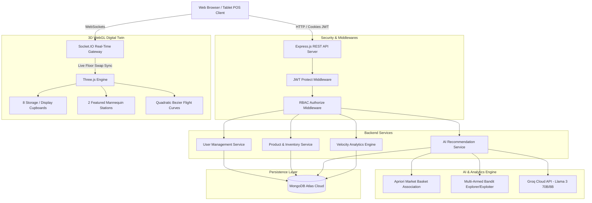

# 🛍️ Velocity Retail — Capstone Project Technical Documentation
> **Autonomous AI-Driven Merchandising Engine & 3D Interactive Digital Twin Showroom**  
> **Student / Developer:** Aaron Alen  
> **Project Type:** Final Year / Capstone Full-Stack & Applied AI Project  
> **Core Technologies:** React 18, TypeScript, Three.js (WebGL), Node.js, Express, MongoDB Atlas, Socket.IO, Groq LLM (Llama 3), TailwindCSS, React-Icons.

---

## 📑 Table of Contents
1. [Project Overview & Problem Statement](#1-project-overview--problem-statement)
2. [High-Level Architecture](#2-high-level-architecture)
3. [Key Modules & Technical Innovations](#3-key-modules--technical-innovations)
   - [3D Interactive Digital Twin Showroom](#31-3d-interactive-digital-twin-showroom-threejs)
   - [AI Recommendation & Merchandising Engine](#32-ai-recommendation--merchandising-engine)
   - [Bilateral 2-Way Flight Physics & Floor Swap State Machine](#33-bilateral-2-way-flight-physics--floor-swap-state-machine)
   - [Enterprise RBAC & Security Infrastructure](#34-enterprise-rbac--security-infrastructure)
   - [Real-Time Inventory & POS Quick Sale](#35-real-time-inventory--pos-quick-sale)
   - [AI Store Copilot (Groq LLM)](#36-ai-store-copilot-groq-llm)
4. [Role-Based Access Control (RBAC) Matrix](#4-role-based-access-control-rbac-matrix)
5. [Database Schema (MongoDB Mongoose)](#5-database-schema-mongodb-mongoose)
6. [API Endpoints Reference](#6-api-endpoints-reference)
7. [Step-by-Step Live Demo Script for Evaluators](#7-step-by-step-live-demo-script-for-evaluators)
8. [Conclusion & Future Enhancements](#8-conclusion--future-enhancements)

---

## 1. Project Overview & Problem Statement

### The Problem in Traditional Retail
In traditional brick-and-mortar retail stores:
* **Static Visual Merchandising:** Physical displays and mannequins are arranged once every few weeks based on intuition rather than real-time sales data.
* **Disconnected Systems:** POS checkout data is separated from physical floor layout tools. Retailers lack real-time visibility into which shelf positions maximize product sell-through.
* **High-Cost Planogram Iterations:** Physical rearrangement of clothes requires manual trial and error without prior simulation or spatial awareness.

### The Solution: Velocity Retail
**Velocity Retail** is an enterprise autonomous merchandising platform that constructs a **real-time 3D Digital Twin Showroom** directly in the browser using Three.js (WebGL). It couples physical store geometry with **Market Basket Analysis (Apriori Algorithm)**, **Multi-Armed Bandit Reinforcement Learning**, and **Groq LLM inference**.

Store managers can simulate, evaluate, and execute **bilateral floor swaps** in real time—watching outfits glide between shelves and mannequins with interactive 3D physics—synchronized across all connected terminals via WebSockets.

---

## 2. High-Level Architecture



---

## 3. Key Modules & Technical Innovations

### 3.1. 3D Interactive Digital Twin Showroom (Three.js)
* **Spatial Planogram Modeling:** A 3D architectural digital twin replicating a luxury boutique flagship store.
* **Component Breakdown:**
  * **8 Cupboard Display Shelves** grouped by apparel categories: Shirts, T-Shirts, Jeans, Jackets, Shoes.
  * **2 Hero Mannequin Stations** placed on elevated round display pedestals with ambient spotlights.
* **Vertical Footwear Elevation Offset:** Customized vertical positioning equations prevent 3D shoe models from clipping into the floor or mannequin base, rendering footwear floating realistically right above the pedestal surface.
* **Interactive Tooling:**
  * Full 360° OrbitControls (Pan, Pinch, Rotate).
  * Raycasting item inspection showing product metadata, stock, and price on hover/click.
  * Camera quick-action presets: Hero Station 1, Hero Station 2, Top-Down Planogram, Front Showcase.
  * Real-Time Sales Heatmap overlay to visualize high-traffic versus slow-moving cupboard zones.

### 3.2. AI Recommendation & Merchandising Engine
The recommendation pipeline executes mathematical market basket associations paired with multi-armed bandit optimization:

1. **Market Basket Analysis (Apriori Algorithm):**
   * Computes **Support**, **Confidence**, and **Lift** across historical customer transaction baskets:
     $$\text{Support}(A \rightarrow B) = \frac{\text{Transactions containing } A \text{ and } B}{\text{Total Transactions } N}$$
     $$\text{Confidence}(A \rightarrow B) = \frac{\text{Support}(A \cup B)}{\text{Support}(A)}$$
     $$\text{Lift}(A \rightarrow B) = \frac{\text{Confidence}(A \rightarrow B)}{\text{Support}(B)}$$
   * Identifies high-affinity outfit combinations (e.g. White Oxford Shirt + Navy Casual Blazer + Tan Leather Loafers).

2. **Contextual Multi-Armed Bandit (MAB):**
   * Solves the **Exploration vs. Exploitation** dilemma in retail merchandising.
   * Exploits top-selling proven product combinations while exploring newly added apparel or slow-moving items with high profit margins to discover hidden retail trends.

### 3.3. Bilateral 2-Way Flight Physics & Floor Swap State Machine
* **Bilateral Physics Trajectories:** When an outfit recommendation is deployed:
  * The newly selected items animate along 3D quadratic Bezier flight curves from their cupboard shelves to the target mannequin station.
  * Displaced items previously worn on that mannequin calculate reverse flight vectors and glide backwards into their original shelf coordinates.
* **Incremental Item Stacking State Machine:**
  * Supports both **full outfit deployment** (Jacket + Shirt + Pants + Shoes) and **1-by-1 incremental swaps** (e.g., swapping only the Pants while keeping the existing Jacket).
  * Prevents state overwrite bugs in MongoDB by merging active items by role (`outerwear`, `topwear`, `bottomwear`, `footwear`).
* **Atomic Reset Engine:**
  * The "Reset Station" button reverts all deployed products on that station back to their exact baseline home coordinates atomically, with complete protection against wildcard storewide animations.

### 3.4. Enterprise RBAC & Security Infrastructure
* **HttpOnly JWT Session Storage:** Authentication tokens are stored exclusively inside `HttpOnly, Secure, SameSite=Strict` HTTP response cookies, rendering them inaccessible to client-side JavaScript (immunizing the application against XSS token harvesting).
* **Server-Side Authorization Middleware:** `protect` and `authorize('admin')` inspect token claims on every incoming REST request.
* **Secure User Creation:** Public registration is disabled on the Login page. New store accounts must be provisioned by an authenticated Administrator via the `POST /api/users` endpoint.
* **Full Viewport Portal Overlays:** The Add User modal utilizes React `createPortal` attached directly to `document.body` with `z-[9999]` and `backdrop-blur-md`, ensuring zero stacking context bleed or top navbar blur cutoffs.

### 3.5. Real-Time Inventory & POS Quick Sale
* Built-in Point-of-Sale (POS) terminal modal supporting Cash, UPI, and Credit Card checkouts.
* Instantaneous inventory decrements synchronized with MongoDB transactions.
* Real-time calculation of key merchandising metrics:
  * **Daily Velocity ($V_d$):** Units sold per day within rolling 7/14/30 day windows.
  * **Days of Stock Remaining ($DSR$):** $\frac{\text{Current Stock}}{V_d}$, alerting managers before stockouts occur.

### 3.6. AI Store Copilot (Groq LLM)
* High-speed inference using **Llama 3** hosted on Groq Cloud.
* Real-time context injection feeding active product stocks, top movers, and planogram status directly into the system prompt for natural language operational queries.

---

## 4. Role-Based Access Control (RBAC) Matrix

| Feature / Action | 👑 Store Administrator (`admin`) | 👔 Floor Manager (`manager`) | 🛒 Cashier / Staff (`staff`) |
| :--- | :---: | :---: | :---: |
| **Authenticate via Secure Cookie** | ✅ Allowed | ✅ Allowed | ✅ Allowed |
| **POS Quick Sale Checkout (Cash/UPI/Card)** | ✅ Allowed | ✅ Allowed | ✅ Allowed |
| **Lookup Stock & Price (Read-Only)** | ✅ Allowed | ✅ Allowed | ✅ Allowed |
| **3D Showroom Exploration & Inspection** | ✅ Allowed | ✅ Allowed | ✅ Allowed (Read-only) |
| **AI Recommendation Calculation** | ✅ Allowed | ✅ Allowed | ❌ Blocked |
| **Execute 3D Floor Swaps to Mannequins** | ✅ Allowed | ✅ Allowed | ❌ Blocked |
| **Reset Mannequin Stations** | ✅ Allowed | ✅ Allowed | ❌ Blocked |
| **Edit Product Price, Details & Images** | ✅ Allowed | ❌ Blocked | ❌ Blocked |
| **Delete Products from Catalog** | ✅ Allowed | ❌ Blocked | ❌ Blocked |
| **Access User Management Tab** | ✅ Allowed | ❌ Hidden & Blocked | ❌ Hidden & Blocked |
| **Create New Employee User Account** | ✅ Allowed | ❌ Blocked | ❌ Blocked |
| **Promote / Demote User Roles** | ✅ Allowed | ❌ Blocked | ❌ Blocked |

---

## 5. Database Schema (MongoDB Mongoose)

### 1. `User` Schema
```typescript
{
  name: { type: String, required: true },
  email: { type: String, required: true, unique: true },
  password: { type: String, required: true }, // Bcrypt hash
  role: { type: String, enum: ['admin', 'manager', 'staff'], default: 'staff' },
  timestamps: true
}
```

### 2. `Product` Schema
```typescript
{
  name: { type: String, required: true },
  category: { type: String, required: true },
  price: { type: Number, required: true },
  costPrice: { type: Number, default: 0 },
  stock: { type: Number, required: true, min: 0 },
  salesVelocity: { type: Number, default: 0 },
  image: { type: String, default: '' },
  coordinates: {
    shelfId: { type: String },
    x: { type: Number },
    y: { type: Number },
    z: { type: Number },
    rotation: { type: Number }
  }
}
```

### 3. `FloorSwap` Schema
```typescript
{
  activePairId: { type: String, required: true },
  stationId: { type: String, required: true },
  spotIndex: { type: Number, required: true },
  executedItems: [{
    productId: { type: Schema.Types.ObjectId, ref: 'Product' },
    role: { type: String }, // 'outerwear' | 'topwear' | 'bottomwear' | 'footwear'
    fromCoords: { x: Number, y: Number, z: Number },
    toCoords: { x: Number, y: Number, z: Number }
  }],
  displacedItems: [{
    productId: { type: Schema.Types.ObjectId, ref: 'Product' },
    fromCoords: { x: Number, y: Number, z: Number },
    toCoords: { x: Number, y: Number, z: Number }
  }],
  status: { type: String, enum: ['active', 'reverted'], default: 'active' },
  timestamps: true
}
```

### 4. `Order` Schema
```typescript
{
  items: [{
    productId: { type: Schema.Types.ObjectId, ref: 'Product' },
    quantity: { type: Number, required: true },
    priceAtSale: { type: Number, required: true }
  }],
  totalAmount: { type: Number, required: true },
  paymentMethod: { type: String, enum: ['cash', 'upi', 'card'] },
  customerName: { type: String, default: 'Walk-in' },
  timestamps: true
}
```

---

## 6. API Endpoints Reference

### Authentication & Users
* `POST /api/auth/login` — Authenticates user, issues JWT in HttpOnly cookie.
* `POST /api/auth/logout` — Clears JWT cookie.
* `GET /api/auth/me` — Fetches current authenticated session claims.
* `GET /api/users` — *(Admin Only)* Returns all registered employees.
* `POST /api/users` — *(Admin Only)* Provisions a new team member with assigned role.
* `PUT /api/users/:id/role` — *(Admin Only)* Updates employee permission level.
* `DELETE /api/users/:id` — *(Admin Only)* Removes user account.

### Products & Inventory
* `GET /api/products` — Returns all showroom products with coordinates and stock.
* `POST /api/products` — *(Admin Only)* Adds new product.
* `PUT /api/products/:id` — *(Admin Only)* Updates pricing, metadata, or coordinates.
* `DELETE /api/products/:id` — *(Admin Only)* Deletes product from database.
* `GET /api/analytics/velocity` — Calculates sales rate and days of inventory remaining.

### Recommendations & Floor Swaps
* `GET /api/recommendations` — Computes and returns AI outfit bundles with Lift & Confidence scores.
* `POST /api/recommendations/recalculate` — Triggers fresh Apriori & MAB computation.
* `POST /api/recommendations/swap` — Records active floor swap and broadcasts WebSockets.
* `POST /api/recommendations/revert` — Atomic rollback of active station items to home shelves.

---

## 7. Step-by-Step Live Demo Script for Evaluators

1. **Enterprise Security & Clean Login (2 Mins):**
   * Navigate to `http://localhost:5173/login`.
   * Explain the absence of public self-registration (retail staff must be registered by store administration).
   * Click the **Admin** demo credential chip and sign in.
   * Navigate to **Users Tab**: showcase team roster, role promotion dropdown, and the Add User modal with full viewport blur portal.

2. **3D Digital Twin Showroom (3 Mins):**
   * Navigate to the **Dashboard** or **Recommendations** view.
   * Demonstrate 360° camera orbit, cupboard inspection, and camera preset buttons.
   * Toggle the **Heatmap mode** to illustrate sales density on shelves.
   * Point out the elevated footwear positioning algorithm on the mannequin pedestal.

3. **AI Recommendation & 3D Flight Physics (3 Mins):**
   * Open the **Recommendations** panel.
   * Explain Market Basket Lift/Confidence metrics and Multi-Armed Bandit ranking.
   * Click **"Deploy to Showroom"**: observe the incoming clothes fly along Bezier curves to the mannequin while displaced items fly back to their shelves.
   * Perform an incremental swap (swap pants individually).
   * Click **"Reset Station"** to prove all items cleanly return home without erratic flight bugs.

4. **Real-Time POS Quick Sale & AI Copilot (2 Mins):**
   * Go to **Products**, click **Quick Sell** on an item, and complete a UPI sale.
   * Show that stock instantly decrements and updates in the database.
   * Open the **AI Store Copilot**, ask a live question about stockout risks, and show the Groq Llama 3 instant response.

---

## 8. Conclusion & Future Enhancements

Velocity Retail successfully bridges digital data analytics with physical store planograms:
* **Current Feats:** Real-time 3D Three.js rendering at 60 FPS, robust incremental floor swap state machine, production-grade JWT HttpOnly security, and live AI Copilot integration.
* **Future Horizons:** Augmented Reality (AR) in-store headset navigation for stock clerks, RFID automated sensor tracking on hangers, and multi-branch warehouse distribution sync.
